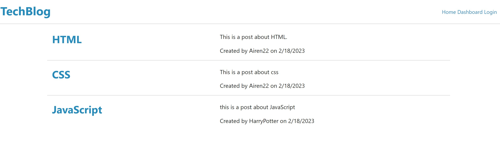
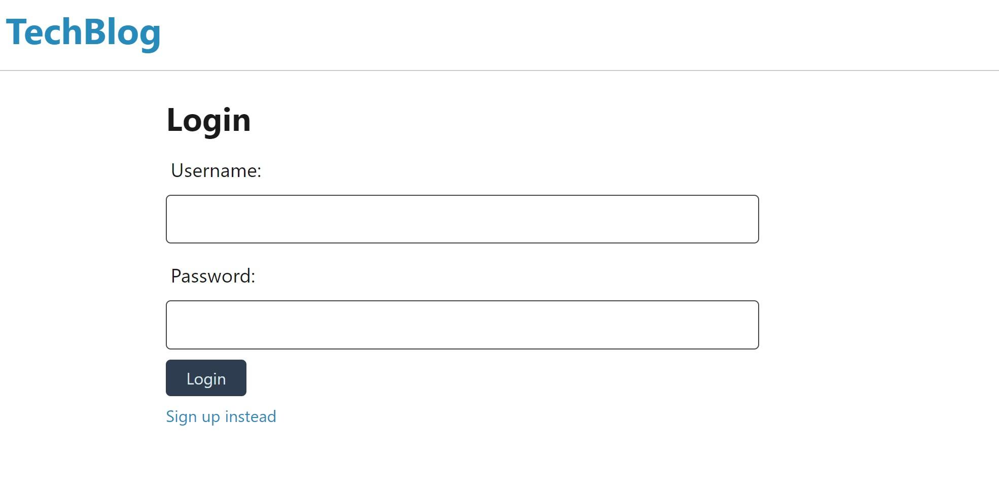
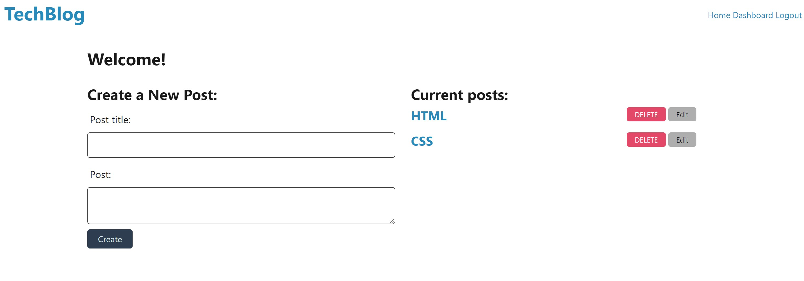
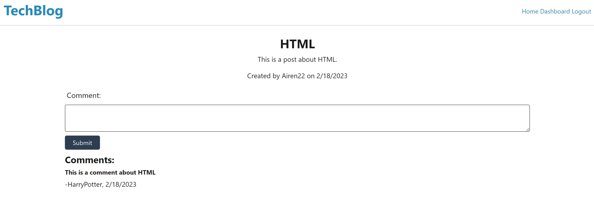

# Bootcamp-Challenge14-TechBlog
UTA coding bootcamp challenge 14 tech blog using MVC

## Description

This tech blog app allows users to create blog posts that include a title and text content and save it to a database. They can view posts from other users on the homepage and view, delete, and edit their own notes on the dashboard. Logged in users can add comments to posts which will be displayed when an individual post is clicked on. 

The following link is the deployed app on heroku:
https://tech-blog22.herokuapp.com/

The following image shows an example of the Tech Blog app homepage:

The following image shows an example of the Tech Blog login page with the option to signup

The following image shows an example of the Tech Blog dashboard page where logged in users can create new blog posts or eidt and delete thier previous posts

The following image shows an example of an indiividual pos, when logged in users can add their own posts

## Installation

N/A

## Usage

Upon loading the page, users are able to view the home page and click on individual posts but any more interaction requires login/signup. 
Once the user accout is created they will be re-routed to their profile page where they can create a new post or view, edit or delete previous posts.
They will also be able to ineract with other users' posts by adding comments. 

## Credits

Karen Peazzoni: https://github.com/kpeazzoni/

Inspired by and based off of UTA Bootcamp Fund My Project

## License

Please refer to the LICENSE in the repo.